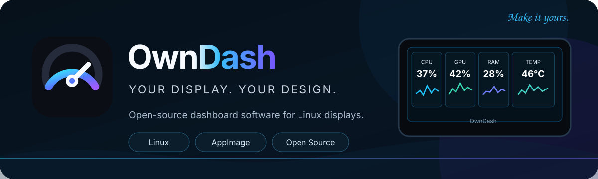
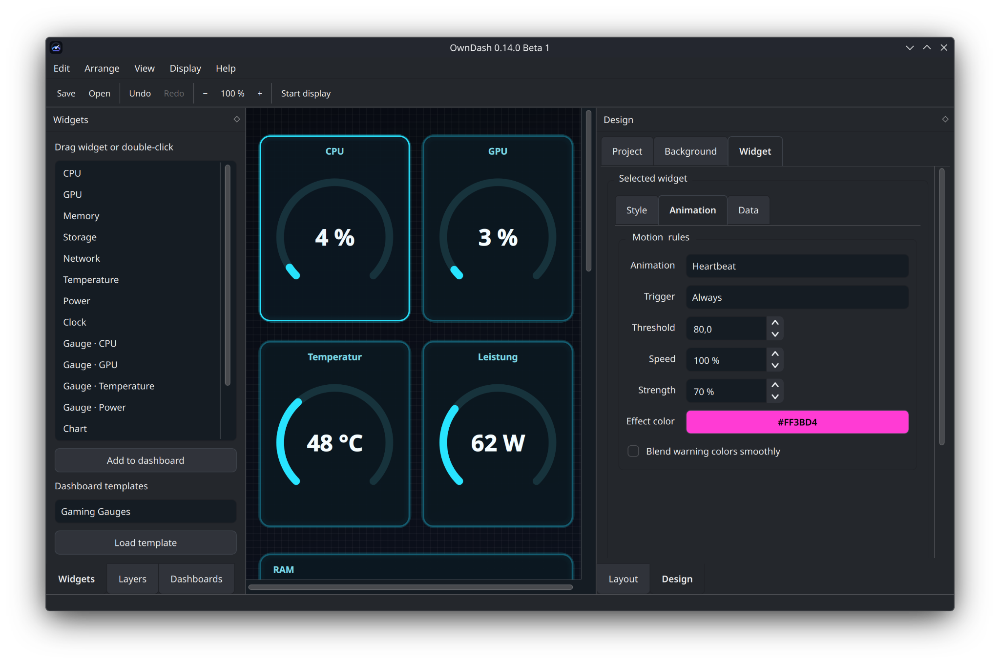
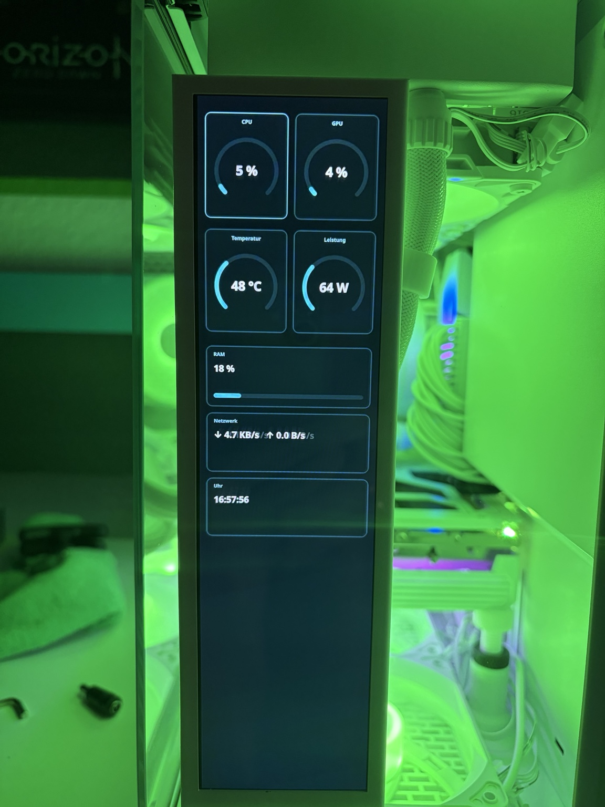

<p align="center">
  
</p>

<p align="center">
  <strong>English</strong> · <a href="README_DE.md">Deutsch</a>
</p>

<p align="center">
  <a href="https://github.com/x-Fuchur-x/owndash/releases/tag/v0.14.0-beta.4"></a>
  
  
  
  <a href="LICENSE"></a>
</p>

# OwnDash

**Create. Customize. Display.**

OwnDash is an open-source visual dashboard editor for Linux. Build hardware-monitoring dashboards with drag & drop, connect live system sensors, and send the result to a compatible USB display or any monitor Linux recognizes — without having to understand Python, `hwmon`, USB protocols, or Linux internals.

> **Current release: OwnDash 0.14.0 Beta 4**  
> Ready-to-run x86-64 AppImage · Debian 12 / GLIBC 2.36 compatibility baseline · direct ArtInChip / VSDISPLAY USB output verified on real hardware.

<p align="center">
  <a href="https://github.com/x-Fuchur-x/owndash/releases/tag/v0.14.0-beta.4"><strong>Download OwnDash 0.14.0 Beta 4</strong></a>
  &nbsp;·&nbsp;
  <a href="https://github.com/x-Fuchur-x/owndash/releases">All releases</a>
  &nbsp;·&nbsp;
  <a href="ROADMAP.md">Roadmap</a>
  &nbsp;·&nbsp;
  <a href="https://github.com/x-Fuchur-x/owndash/issues">Issues</a>
</p>

## Why OwnDash?

OwnDash is built for people who want a dedicated system display without turning dashboard setup into a terminal project.

- **Visual editor** — design dashboards with drag & drop and live previews.
- **Real Linux telemetry** — CPU, GPU, RAM, storage, network, temperatures, power and other metrics where the hardware exposes them.
- **Flexible widgets** — gauges, charts, sparklines, clocks, text, images, backgrounds, themes and animated elements.
- **Multiple dashboard pages** — organize different layouts and cycle between them.
- **Sensor-driven behavior** — animations, rules and alert states can react to live values.
- **Two output paths** — standard Linux monitors and compatible direct USB displays.
- **Beginner-friendly setup** — first-run compatibility checks, diagnostics and graphical USB-permission setup.
- **Linux-native approach** — built around common Linux interfaces instead of one specific distribution.
- **English and German UI** — plus System, Light and Dark appearance modes.
- **Open source** — MIT licensed and designed to grow with additional hardware backends over time.

## See OwnDash in action

<table>
  <tr>
    <td width="50%" valign="top">
      
      <br><strong>Visual dashboard editor</strong><br>
      Build and customize dashboards without editing configuration files by hand.
    </td>
    <td width="50%" valign="top">
      
      <br><strong>Real hardware output</strong><br>
      OwnDash running on a compatible ArtInChip / VSDISPLAY USB sensor display.
    </td>
  </tr>
</table>

## Display support

OwnDash currently supports two display paths:

### Standard Linux monitors

Use displays that Linux already recognizes as regular screens, including HDMI, DisplayPort and USB-C display outputs. OwnDash can show the dashboard in a dedicated output window with fullscreen safety controls.

Monitor selection shows the model (when supplied by the system), connector and pixel dimensions calculated from Qt geometry and display scaling. Fullscreen output targets the selected screen explicitly. Switching from USB to a standard monitor defaults to 0° rotation; manual rotation remains available.

Existing layouts are fitted proportionally and centered across dashboard pages. The editor automatically fits the working area; use **Fit** to return after manual zoom. Fitted layout bounds are saved with the profile to avoid shrinking the layout repeatedly when switching aspect ratios. Widget contents (fonts, spacing, borders and effects) scale together with their geometry. The content scale and fractional positions are saved with the profile; existing profiles retain their original appearance. Shutdown artwork uses the display resolution and output rotation, with larger branding and an adaptive landscape/portrait layout.

Mixed-DPI output is tested with simulated Qt screens; compositor-specific fullscreen placement still needs confirmation on real hardware.

### Direct ArtInChip / VSDISPLAY USB output

Compatible ArtInChip-based sensor displays can be driven directly over USB without appearing as a normal monitor. The official AppImage bundles the required `libusb-1.0.so.0` runtime.

The development branch includes capability-driven UI groundwork for optional display controls. For the `33C3:0E02` backend, hardware brightness, device-version queries, panel queries and Expansion Screen Mode remain disabled: a compatible control transport has not been verified. Unsupported controls stay hidden. No brightness range or power-off behavior is established for this device.

Startup-image/video upload is intentionally not advertised yet; it is planned as a separate hardware-verified phase.

Other proprietary USB-only display families need their own backend and protocol support. Broader hardware support is part of the long-term project direction — see the [roadmap](ROADMAP.md).

## Easy first start

### Required

The official release is a **self-contained x86-64 AppImage**. Python knowledge is not required, and no separate installation of Python or PySide6 is required when using the official AppImage.

**Current file:** `OwnDash-0.14.0-Beta-3-x86_64.AppImage`

1. Download the AppImage from the [OwnDash 0.14.0 Beta 4 release](https://github.com/x-Fuchur-x/owndash/releases/tag/v0.14.0-beta.4).
2. Make it executable if your desktop requires it.
3. Launch OwnDash by double-clicking the AppImage.
4. Follow the first-run setup and compatibility assistant.
5. Create a dashboard and select your output display.

### Optional — only for additional features

For compatible direct USB displays, OwnDash can offer graphical installation of the required USB permission rule using your desktop's normal administrator authentication. No privileged command is executed automatically at startup. Standard monitor output does not require this USB permission setup.

## Sensors & compatibility

OwnDash reads common Linux interfaces such as `/proc`, `sysfs`, `hwmon`, DRM and `powercap`. Sensor availability therefore depends on the kernel, driver and hardware rather than on one specific distribution.

A missing optional metric is **not** treated as an application failure. For example, a GPU may expose utilization and temperature but not power consumption; OwnDash keeps working and marks that individual metric as unavailable.

Additional NVIDIA telemetry can be obtained through `nvidia-smi` when available. AMDGPU VRAM usage, used GiB and total GiB are supported where the required sysfs counters are exposed.

OwnDash includes **Help → System and sensor information** for detailed capability diagnostics.

### Current AppImage baseline

- Linux on **x86-64**
- **GLIBC 2.36 or newer**
- Graphical Linux desktop environment
- Official release builds produced on a **Debian 12 compatibility baseline**

GitHub CI builds the official Beta 3 AppImage on Debian 12, verifies the GLIBC compatibility baseline, and performs a clean Debian 12 AppImage startup smoke test. Hardware, sensors, graphics and USB capabilities can still vary between systems.

## Tested hardware & platform

Beta 3 has been practically tested with:

- Bazzite Linux
- KDE Plasma
- AMD CPU/GPU hardware
- x86-64
- Compatible ArtInChip / VSDISPLAY direct USB hardware
- Standard Linux monitor output

OwnDash does **not** require Bazzite or KDE. Reports from other distributions, desktop environments, GPUs and display types are welcome.

## Running from source

Python **3.11 or newer** is required when running OwnDash from source.

```bash
python -m pip install -e .
owndash
```

Core dependencies are declared in `pyproject.toml` and include PySide6, Pillow, PyUSB and cryptography.

## Project links

- **[Roadmap](ROADMAP.md)** — planned direction toward 1.0 and broader device support
- **[Changelog](CHANGELOG.md)** — released features and version history
- **[Contributing](CONTRIBUTING.md)** — how to contribute
- **[Issues](https://github.com/x-Fuchur-x/owndash/issues)** — bugs and feature requests
- **[Releases](https://github.com/x-Fuchur-x/owndash/releases)** — AppImages and release notes

## Beta status

OwnDash is currently beta software. Bugs and compatibility issues are possible, and feedback from different Linux distributions, hardware configurations and display types is especially useful during this phase.

## License

OwnDash is released under the **MIT License**. Third-party components and acknowledgements are documented in [`THIRD_PARTY.md`](THIRD_PARTY.md).

<p align="center">
  <strong>Your display. Your design.</strong><br>
  Built for Linux · Open source · Made to be yours
</p>

Copyright © 2026 **Markus Rosinski**
