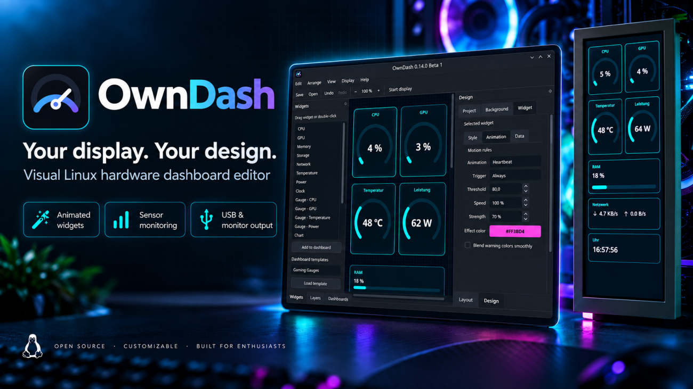

<p align="center">
  
</p>

<p align="center">
  <a href="README.md">English</a> · <strong>Deutsch</strong>
</p>

<p align="center">
  <a href="https://github.com/x-Fuchur-x/owndash/releases/tag/v0.14.0-beta.4"></a>
  
  
  
  <a href="LICENSE"></a>
</p>

# OwnDash

**Erstellen. Anpassen. Anzeigen.**

OwnDash ist ein visueller Open-Source-Dashboard-Editor für Linux. Erstelle Hardware-Monitoring-Dashboards per Drag & Drop, verbinde Live-Systemsensoren und gib das Ergebnis auf einem kompatiblen USB-Display oder jedem von Linux erkannten Monitor aus — ohne dich mit Python, `hwmon`, USB-Protokollen oder Linux-Interna beschäftigen zu müssen.

> **Aktuelle Version: OwnDash 0.14.0 Beta 4**  
> Startfertiges x86-64-AppImage · Debian-12-/GLIBC-2.36-Kompatibilitätsbasis · direkte ArtInChip-/VSDISPLAY-USB-Ausgabe auf echter Hardware verifiziert.

<p align="center">
  <a href="https://github.com/x-Fuchur-x/owndash/releases/tag/v0.14.0-beta.4"><strong>OwnDash 0.14.0 Beta 4 herunterladen</strong></a>
  &nbsp;·&nbsp;
  <a href="https://github.com/x-Fuchur-x/owndash/releases">Alle Releases</a>
  &nbsp;·&nbsp;
  <a href="ROADMAP.md">Roadmap</a>
  &nbsp;·&nbsp;
  <a href="https://github.com/x-Fuchur-x/owndash/issues">Issues</a>
</p>

## Warum OwnDash?

OwnDash richtet sich an alle, die ein eigenes Systemdisplay möchten, ohne dass die Einrichtung zum Terminal-Projekt wird.

- **Visueller Editor** — Dashboards per Drag & Drop mit direkter Vorschau gestalten.
- **Echte Linux-Telemetrie** — CPU, GPU, RAM, Speicher, Netzwerk, Temperaturen, Leistung und weitere Werte, sofern die Hardware sie bereitstellt.
- **Flexible Widgets** — Anzeigen, Diagramme, Sparklines, Uhren, Text, Bilder, Hintergründe, Themes und animierte Elemente.
- **Mehrere Dashboard-Seiten** — verschiedene Layouts organisieren und automatisch wechseln.
- **Sensorabhängiges Verhalten** — Animationen, Regeln und Warnzustände können auf Live-Werte reagieren.
- **Zwei Ausgabewege** — normale Linux-Monitore und kompatible direkte USB-Displays.
- **Einsteigerfreundliche Einrichtung** — Ersteinrichtungs-Assistent, Kompatibilitätsprüfung, Diagnosen und grafische USB-Rechte-Einrichtung.
- **Optionale Update-Hinweise** — OwnDash kann nach neueren Releases suchen, ohne etwas automatisch herunterzuladen oder zu installieren.
- **Linux-nativer Ansatz** — basiert auf verbreiteten Linux-Schnittstellen statt auf einer einzelnen Distribution.
- **Deutsche und englische Oberfläche** — inklusive System-, Hell- und Dunkelmodus.
- **Open Source** — MIT-lizenziert und langfristig für zusätzliche Hardware-Backends ausgelegt.

## OwnDash in Aktion

<table>
  <tr>
    <td width="50%" valign="top">
      
      <br><strong>Visueller Dashboard-Editor</strong><br>
      Dashboards erstellen und anpassen, ohne Konfigurationsdateien von Hand bearbeiten zu müssen.
    </td>
    <td width="50%" valign="top">
      
      <br><strong>Ausgabe auf echter Hardware</strong><br>
      OwnDash auf einem kompatiblen ArtInChip-/VSDISPLAY-USB-Sensordisplay.
    </td>
  </tr>
</table>

## Display-Unterstützung

OwnDash bietet aktuell zwei Ausgabewege:

### Normale Linux-Monitore

Displays, die Linux bereits als normale Bildschirme erkennt, können über HDMI, DisplayPort, USB-C und andere Standard-Ausgänge verwendet werden. OwnDash kann das Dashboard in einem eigenen Ausgabefenster mit Fullscreen-Sicherheitsfunktionen darstellen.

Die Monitorauswahl zeigt — sofern vom System geliefert — Modell, Anschluss und die aus Qt-Geometrie und Displayskalierung berechneten Pixelabmessungen. Die Vollbildausgabe wird gezielt auf dem ausgewählten Bildschirm geöffnet. Beim Wechsel von USB auf einen normalen Monitor verwendet OwnDash standardmäßig 0° Rotation; die manuelle Rotation bleibt verfügbar.

Bestehende Layouts werden proportional eingepasst und auf allen Dashboard-Seiten zentriert. Der Editor passt den Arbeitsbereich automatisch ein; mit **Fit** lässt sich nach manuellem Zoom jederzeit zur passenden Ansicht zurückkehren. Eingepasste Layoutgrenzen werden im Profil gespeichert, damit ein Layout bei wiederholten Seitenverhältniswechseln nicht immer weiter schrumpft. Widget-Inhalte wie Schriftarten, Abstände, Rahmen und Effekte skalieren gemeinsam mit der Geometrie. Inhaltsskalierung und relative Positionen werden im Profil gespeichert; bestehende Profile behalten ihr bisheriges Erscheinungsbild. Das Pause-/Shutdown-Bild berücksichtigt Displayauflösung und Ausgaberotation und verwendet ein adaptives Hoch-/Querformat-Layout.

Mixed-DPI-Ausgabe wurde mit simulierten Qt-Bildschirmen getestet; compositor-spezifische Vollbildplatzierung muss auf weiterer echter Hardware noch bestätigt werden.

### Direkte ArtInChip-/VSDISPLAY-USB-Ausgabe

Kompatible ArtInChip-basierte Sensordisplays können direkt über USB angesteuert werden, ohne als normaler Monitor im System erscheinen zu müssen. Das offizielle AppImage bringt die benötigte `libusb-1.0.so.0`-Laufzeitbibliothek mit.

OwnDash enthält eine fähigkeitsbasierte Oberfläche als Grundlage für optionale Display-Steuerungen. Beim Backend `33C3:0E02` bleiben Hardware-Helligkeit, Geräteversionsabfragen, Panel-Abfragen und Expansion Screen Mode deaktiviert, weil dafür noch kein kompatibler Steuertransport verifiziert wurde. Nicht unterstützte Funktionen bleiben ausgeblendet. Für dieses Gerät sind weder ein Helligkeitsbereich noch ein definiertes Hardware-Power-off-Verhalten bestätigt.

Das Hochladen eines persistenten Startbilds oder Startvideos wird bewusst noch nicht angeboten; dafür ist eine separate Verifikation mit echter Hardware vorgesehen.

Andere proprietäre USB-only-Displays benötigen ein eigenes Backend und Protokollunterstützung. Eine breitere Hardware-Unterstützung ist Teil der langfristigen Projektrichtung — siehe [Roadmap](ROADMAP.md).

## Download & Schnellstart

### Erforderlich

Die offizielle Version wird als eigenständiges **x86-64-AppImage** bereitgestellt. Bei Verwendung des offiziellen AppImages sind weder Python-Kenntnisse noch eine separate Installation von Python oder PySide6 erforderlich.

**Aktuelles Release-Asset:** `OwnDash-0.14.0-Beta-4-x86_64.AppImage`

1. AppImage vom [OwnDash-0.14.0-Beta-4-Release](https://github.com/x-Fuchur-x/owndash/releases/tag/v0.14.0-beta.4) herunterladen.
2. Falls erforderlich, die Datei ausführbar machen.
3. OwnDash per Doppelklick starten.
4. Den Ersteinrichtungs- und Kompatibilitäts-Assistenten durchlaufen.
5. Dashboard erstellen und Ausgabedisplay auswählen.

### Optional — nur für zusätzliche Funktionen

Für kompatible direkte USB-Displays kann OwnDash die benötigte USB-Berechtigungsregel grafisch über die normale Administrator-Authentifizierung des Desktops installieren. Beim Programmstart wird kein privilegierter Befehl automatisch ausgeführt. Für normale Monitorausgabe ist diese USB-Berechtigung nicht erforderlich.

## Sensoren & Kompatibilität

OwnDash verwendet verbreitete Linux-Schnittstellen wie `/proc`, `sysfs`, `hwmon`, DRM und `powercap`. Welche Sensoren verfügbar sind, hängt deshalb von Kernel, Treiber und Hardware ab — nicht von einer bestimmten Linux-Distribution.

Ein fehlender optionaler Messwert gilt **nicht** als Programmfehler. Eine GPU kann zum Beispiel Auslastung und Temperatur liefern, aber keine Leistungsaufnahme; OwnDash funktioniert weiter und kennzeichnet lediglich diesen einzelnen Wert als nicht verfügbar.

Zusätzliche NVIDIA-Telemetrie kann über `nvidia-smi` genutzt werden, sofern vorhanden. AMDGPU-VRAM-Auslastung sowie belegter und gesamter VRAM in GiB werden unterstützt, wenn die benötigten sysfs-Zähler verfügbar sind.

Unter **Hilfe → System- und Sensorinformationen** zeigt OwnDash detailliert an, welche Funktionen erkannt wurden.

### Aktuelle AppImage-Basis

- Linux auf **x86-64**
- **GLIBC 2.36 oder neuer**
- Grafische Linux-Desktopumgebung
- Offizielle Release-Builds auf einer **Debian-12-Kompatibilitätsbasis**

GitHub CI baut das offizielle AppImage auf Debian 12, prüft die GLIBC-Kompatibilitätsbasis und führt einen AppImage-Starttest in einer sauberen Debian-12-Umgebung aus. Hardware-, Sensor-, Grafik- und USB-Funktionen können sich trotzdem je nach System unterscheiden.

## Getestete Hardware & Plattform

OwnDash 0.14.0 Beta 4 wurde praktisch getestet mit:

- Bazzite Linux
- KDE Plasma
- AMD-CPU-/GPU-Hardware
- x86-64
- kompatibler direkter ArtInChip-/VSDISPLAY-USB-Hardware
- normaler Linux-Monitorausgabe

OwnDash benötigt **weder Bazzite noch KDE**. Rückmeldungen zu anderen Distributionen, Desktopumgebungen, GPUs und Displays sind ausdrücklich willkommen.

## Aus dem Quellcode starten

Für den Start aus dem Quellcode wird Python **3.11 oder neuer** benötigt.

```bash
python -m pip install -e .
owndash
```

Die zentralen Abhängigkeiten sind in `pyproject.toml` definiert und umfassen PySide6, Pillow, PyUSB und cryptography.

## Projektlinks

- **[Roadmap](ROADMAP.md)** — geplante Entwicklung Richtung 1.0 und weitere Display-Unterstützung
- **[Changelog](CHANGELOG.md)** — veröffentlichte Funktionen und Versionshistorie
- **[Contributing](CONTRIBUTING.md)** — Hinweise zum Mitmachen
- **[Issues](https://github.com/x-Fuchur-x/owndash/issues)** — Fehler und Funktionswünsche
- **[Releases](https://github.com/x-Fuchur-x/owndash/releases)** — AppImages und Release Notes

## Beta-Status

OwnDash befindet sich weiterhin in der Beta-Phase. Fehler und Kompatibilitätsprobleme sind möglich. Rückmeldungen aus unterschiedlichen Linux-Distributionen, Hardware-Konfigurationen und Display-Typen sind während dieser Phase besonders wertvoll.

## Lizenz

OwnDash wird unter der **MIT-Lizenz** veröffentlicht. Drittanbieter-Komponenten und Danksagungen sind in [`THIRD_PARTY.md`](THIRD_PARTY.md) dokumentiert.

<p align="center">
  <strong>Your display. Your design.</strong><br>
  Für Linux · Open Source · Dein Dashboard
</p>

Copyright © 2026 **Markus Rosinski**
